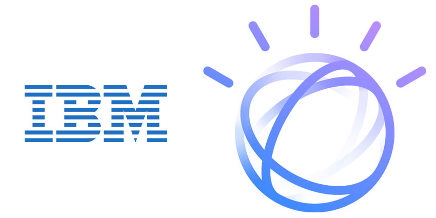
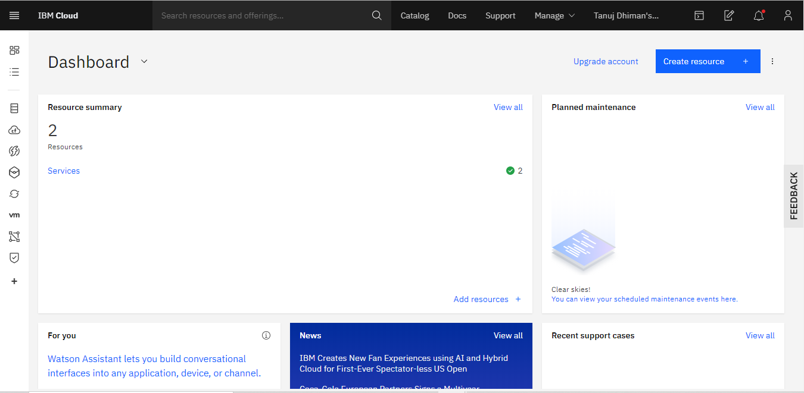
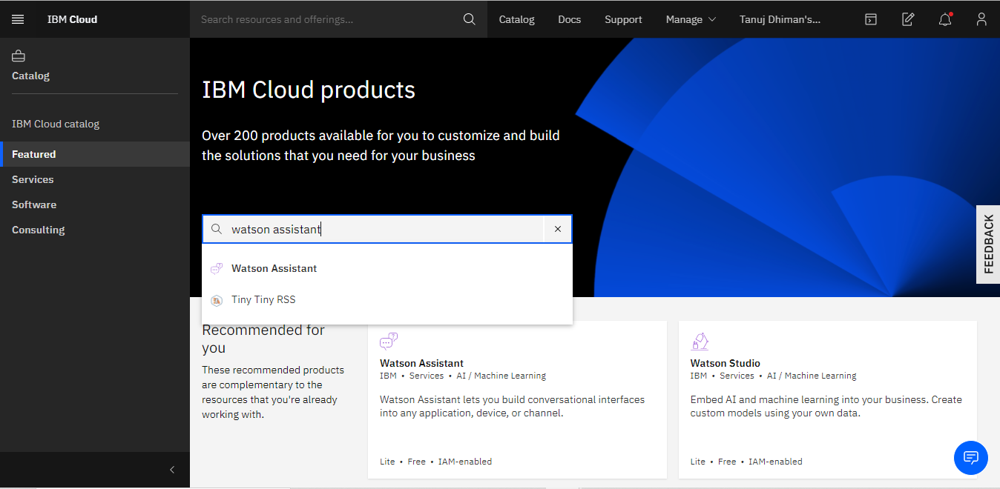
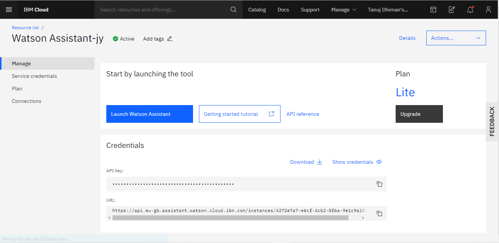
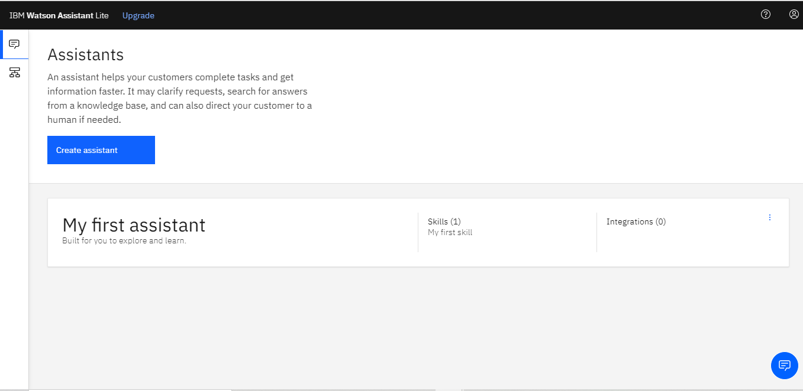

# IBM Watson Chatbot

Watson was created as a question answering (QA) computing system that IBM built to apply advanced natural language processing, information retrieval, knowledge representation, automated reasoning, and machine learning technologies to the field of open domain question answering.

I will explained how to make chatbots using IBM and believe me it is just 30 minutes practice. No need to write extra code and all stuff of Deployment of Chatbot just give some intents and integrate it as preview link or facebook messenger and slack etc whatever you can use by IBM.

**So Let's get started :**
_______________
First Basic step we have to do is that we have to make a IBM Account on [Link](https://cloud.ibm.com/).
* In this you just finish the verfication and all stuff that is required.

Then go to IBM dashboard but let me know that you are only have permission of making one Watson Assistant not two or three. 

When you click on IBM Cloud you can see the dashboard there. And just as 

As we all know about the IBM, it is a huge platform of making not only chatbots but translators, discoveries, text to speech and vice versa etc.
In this we are gonna to make a simple chatbot by this you can have a idea of what and how watson work in actual or real-life.

In the navigation bar i.e three lines in the left of the dashboard page, click on that and then click on RESOURCES LIST. Here you can see the list of resoureces you have used and those you haven't use yet. We are gonna make a service name **Watson Assistant**. SO how will you approach that.
After clicking on Create Resourecs you will see a page like 

Just Click on Watson Assistant and you will see a create page. In this there are a lot of text inputs like region, plan, watson etc.
I prefer to choose 
* Region - London if you are from the country in the given list then choose that.
* Plan - LITE if you haven't a subscription of IBM.
* Service Name - You have write watson-assistant-__ then you can write either of a number or alphabet like c9, 5n etc.

And in this page you just choose the plan and leave all in their default positions.Click on **Create**. Okay we are going to launch Watson Assistant and make sure you are with me on this page :

And one more thing here is, if you want to use this watson assistant in outside code so there you can see the API key and URL of this just copy and paste wherever you want to use this assistant. This is a great opporunity which watson offer.
Here you can see two buttons :
* Launch Watson Assistant
* Getting Started Tutorial
If you are not comfortable with my instructions you will follow up the tutorial too. Here is the link of that : https://cloud.ibm.com/docs/services/assistant?topic=assistant-getting-started#getting-started-tutorial

SO, CLick on Launch Watson Assistant. A another window will appear like that :

You can see there is a default assistant here Yep it has a default assistant. Just go into it there you can see a skills just click on that.
Then you can many buttons on the nav bar.

There is :
* Intents
* Entities
* Dialog
* Options
* Content Catalog

**Intents :** It means like a user say hello but we know we can start with Hi, Hey, What's app, How arer you etc. these are some user examples which we can communicate with the bot we going to make. So put these in a single intent named as Hello-messages then add all the hello messages in it so that watson assistant can easily understand what the user is saying. 

**Note :** We have to add at least 5 user examples to an intent for the understanding of watson assistant.

**Entities :** It means a particular word like for example What is the weather today ? So here is Today is a entity that contain the today's tomorrow and something else. So extract the particular word from the user sentense that is entity I called. 

**Dialog :** When you message to bot like "Hello, What are you doing ?" So bot have to answer it like "Yep, I am waiting for you." That much so these are called dialog skills. In these we put a respone to user message here.

**Note :** You can add muliple responses in Watson Assistant. 
CONTINUE......................
